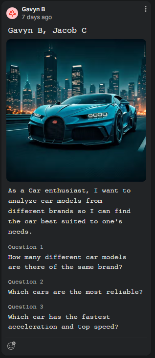

# data-for-social-good-project
## User Story

Unfortunately we could not do reliability since there were no datasets with MPG and there were too many engines to manually put in data for, but we found better categories to pick from. We did find better categories to sort by though.
## Dataset
### Cars Datasets (2025)
https://www.kaggle.com/datasets/abdulmalik1518/cars-datasets-2025?resource=download
### To Google Sheets (Cleaned and Converted to MPH)
https://docs.google.com/spreadsheets/d/1qm1jmWBBxUXIdRcUU3V97Ahfx8YlmpaY-9MzjUboTPY/edit?usp=sharing
## UML Diagram
 UML Diagram.jpg>)
## Description
This program allows the user to analyze different categories of car data based on text files that contain the statistics/specifications of the car. DataRunner instantiates a UserStory object, passing in the car data text files as arguments. The text files are converted into arrays based on their data type and car objects are instantiated and put into array cars, so that the data can be easily accessed and analyzed. The user can interact and choose which category they want to analyze and the highest/lowest of that category. You can analyze by prices, horsepowers, topspeeds, and accelerations. You can also pick a random car. After going through the process, the car information is printed through its toString() method so the user can see what car aligns to their needs.